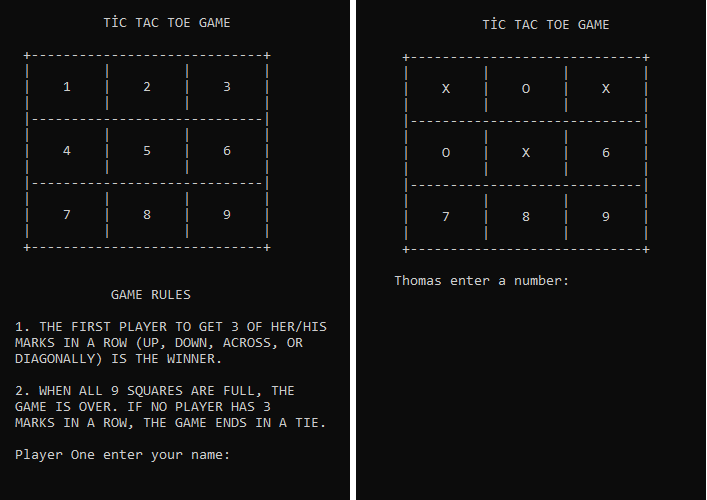

# Tic Tac Toe

In this project, we built tic tac toe game from scratch using Ruby progamming language, the project is a requirement in Microverse technical curriculum.

### Game rules and instructions

This game is simple and very popular, it's played by two players, each one gets a distinguished symbol (usually X or O).
The objective for each player is to place own sybmol on three squares that comprise a straight line. The line may be horizontal, vertical or diagonal. Whoever acheives this goal first wins.
In case of all the squares get occupied without any player winning, it's called a tie or draw.

After every tie or winning, the game will give option to play again or quit by prompting the player to enter Y or N respectivly
  

### Screenshots

### How to start the game:
You can either play the game online by clicking on the link below:

Link: [Live Demo Link](https://repl.it/@Rayan84/tic-tac-toe#.replit)

or you can play it on your computer by following these steps:

1. Download the repository from this [link](https://github.com/ahmetbozaci/tic-tac-toe/archive/readme_game_instructions.zip)
2. Unzip the files
3. Open the command prompt or terminal and browse to folder containing main.rb file
4. Type ruby main.rb 
5. Press enter
 

### :hammer: Built With

* Ruby
* Atom
* VScode
* Rubocop

###  :bust_in_silhouette: Worked on this challenge:
## Rayan Rassam
* Github:[@Rayan84](https://github.com/Rayan84)
* Twitter:[@Rayan65096267](https://twitter.com/Rayan65096267)
* LinkedIn:[@rayan rassam](https://www.linkedin.com/in/rayan-rassam-18a0a426/)

## Ahmet Bozacı
* Github:[@ahmtbozaci](https://github.com/ahmetbozaci)
* Twitter:[@ahmtbozaci](https://twitter.com/ahmtbozaci)
* LinkedIn:[@ahmtbozaci](https://www.linkedin.com/in/ahmetbozaci/)

### Credits
The project is part of Microverse Technical curriculum - Ruby section

### Contribution
Feedbacks, issues or feature requests are welcomed!
Please follow this link to create an issue [Link](https://github.com/ahmetbozaci/tic-tac-toe/issues) and help me improve!
